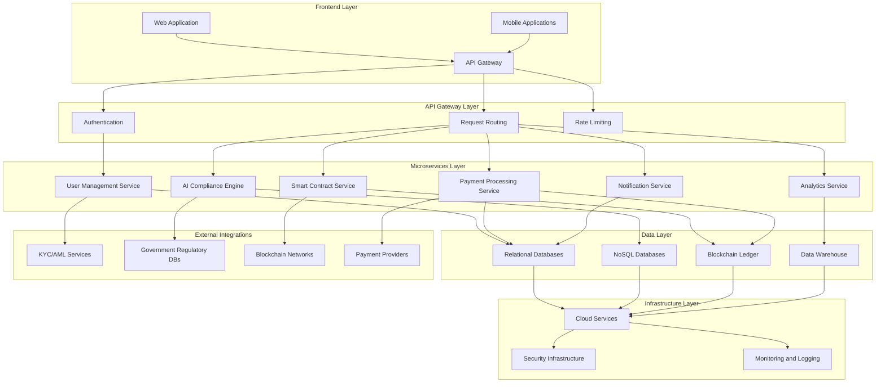

```mermaid
graph TD
    subgraph "Frontend Layer"
        A1[Web Application] --> A2[API Gateway]
        A3[Mobile Applications] --> A2
    end
    
    subgraph "API Gateway Layer"
        A2 --> B1[Authentication]
        A2 --> B2[Request Routing]
        A2 --> B3[Rate Limiting]
    end
    
    subgraph "Microservices Layer"
        B1 --> C1[User Management Service]
        B2 --> C2[AI Compliance Engine]
        B2 --> C3[Smart Contract Service]
        B2 --> C4[Payment Processing Service]
        B2 --> C5[Notification Service]
        B2 --> C6[Analytics Service]
    end
    
    subgraph "Data Layer"
        C1 --> D1[Relational Databases]
        C2 --> D2[NoSQL Databases]
        C3 --> D3[Blockchain Ledger]
        C4 --> D1
        C4 --> D3
        C5 --> D1
        C6 --> D4[Data Warehouse]
    end
    
    subgraph "External Integrations"
        C1 --> E1[KYC/AML Services]
        C2 --> E2[Government Regulatory DBs]
        C3 --> E3[Blockchain Networks]
        C4 --> E4[Payment Providers]
    end
    
    subgraph "Infrastructure Layer"
        D1 --> F1[Cloud Services]
        D2 --> F1
        D3 --> F1
        D4 --> F1
        F1 --> F2[Security Infrastructure]
        F1 --> F3[Monitoring and Logging]
    end
```
